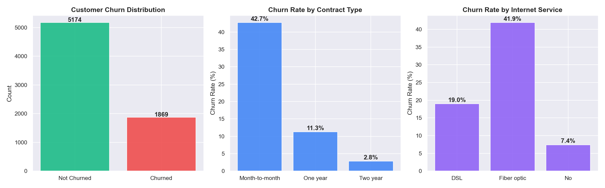
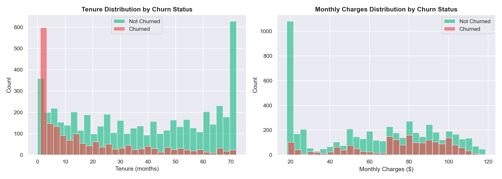
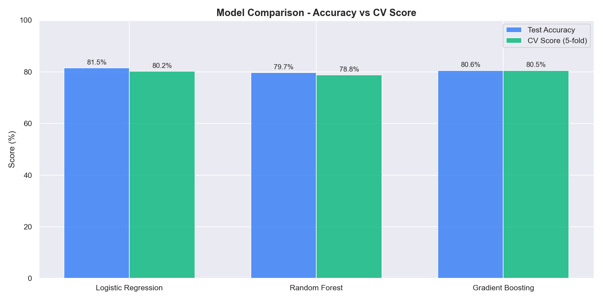
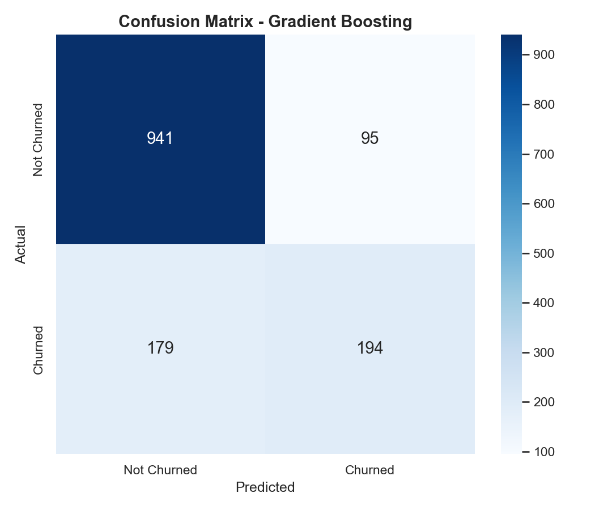
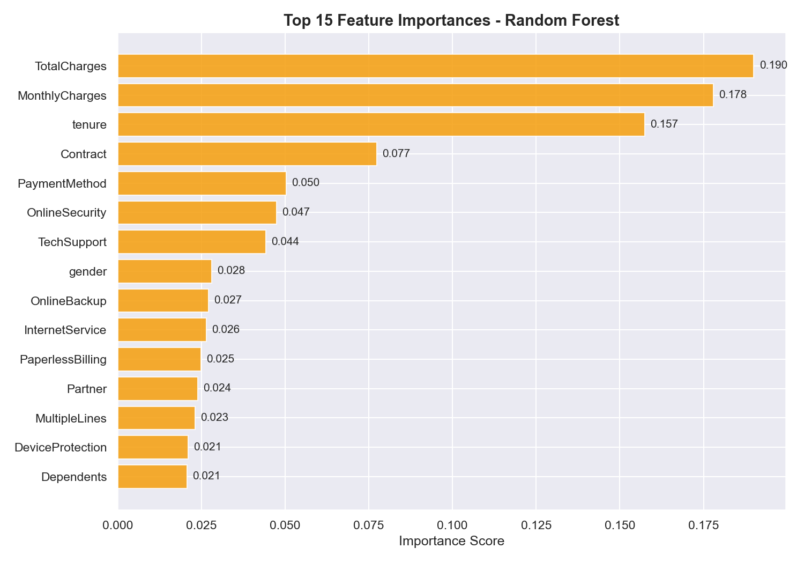

# 📉 ChurnGuard — Customer Churn Prediction

A machine learning classification project that predicts which telecom customers are likely to churn. Compares Logistic Regression, Random Forest and Gradient Boosting on 7,043 real customer records.

---

## 📋 Table of Contents

- 🎯 Project Overview
- 📊 Key Questions Answered
- 📈 Visualizations
- 🛠️ Technologies Used
- 📁 Project Structure
- 🚀 How to Run
- 💡 Key Findings
- 👨‍💻 Author

---

## 🎯 Project Overview

This project applies binary classification to predict customer churn for a telecom company. The dataset contains 7,043 customers with features covering demographics, account information, subscribed services and billing details.

The analysis covers:
- Exploratory data analysis of churn patterns
- Data cleaning, feature engineering and scaling
- Model training — Logistic Regression, Random Forest and Gradient Boosting
- Model comparison using accuracy and 5-fold cross-validation
- Feature importance analysis to identify key churn drivers

---

## 📊 Key Questions Answered

- What is the overall churn rate?
- How does contract type affect churn?
- Do monthly charges and tenure influence churn behaviour?
- Which model best predicts customer churn?
- What are the most important features in predicting churn?

---

## 📈 Visualizations

### Churn Overview


### Tenure and Monthly Charges by Churn Status


### Model Comparison - Accuracy vs CV Score


### Confusion Matrix


### Top 15 Feature Importances - Random Forest


---

## 🛠️ Technologies Used

- **Language:** Python 3.12
- **Data Manipulation:** Pandas, NumPy
- **Machine Learning:** Scikit-learn
- **Visualization:** Matplotlib, Seaborn
- **Environment:** Jupyter Notebook

---

## 📁 Project Structure

```
ChurnGuard/
├── analysis.ipynb          ← Main analysis notebook
├── requirements.txt
├── LICENSE
├── README.md
├── data/
│   └── WA_Fn-UseC_-Telco-Customer-Churn.csv   ← Raw dataset (not tracked by git)
└── outputs/
    ├── churn_overview.png
    ├── tenure_charges.png
    ├── model_comparison.png
    ├── confusion_matrix.png
    └── feature_importance.png
```

---

## 🚀 How to Run

**1. Install dependencies:**
```bash
pip install -r requirements.txt
```

**2. Download the dataset:**

Get the CSV from [Kaggle](https://www.kaggle.com/datasets/blastchar/telco-customer-churn) and place it inside the `data/` folder.

**3. Run the notebook:**
```bash
jupyter notebook analysis.ipynb
```

Run all cells top to bottom. Charts will be saved automatically to `outputs/`.

---

## 💡 Key Findings

- Overall churn rate is approximately 26% across all customers
- **Month-to-month contracts** have a significantly higher churn rate than one or two-year contracts
- **Fibre optic** internet service customers churn at a higher rate than DSL customers
- Customers with shorter tenure and higher monthly charges are more likely to churn
- **Tenure**, **monthly charges** and **contract type** are the top predictors of churn

---

## 👨‍💻 Author

**Berke Arda Turk**  
Data Science & AI Enthusiast | Computer Science (B.ASc)  
[🌐 Portfolio](https://berkeardaturk.com) · [💼 LinkedIn](https://www.linkedin.com/in/berke-arda-turk/) · [🐙 GitHub](https://github.com/Mood07)
